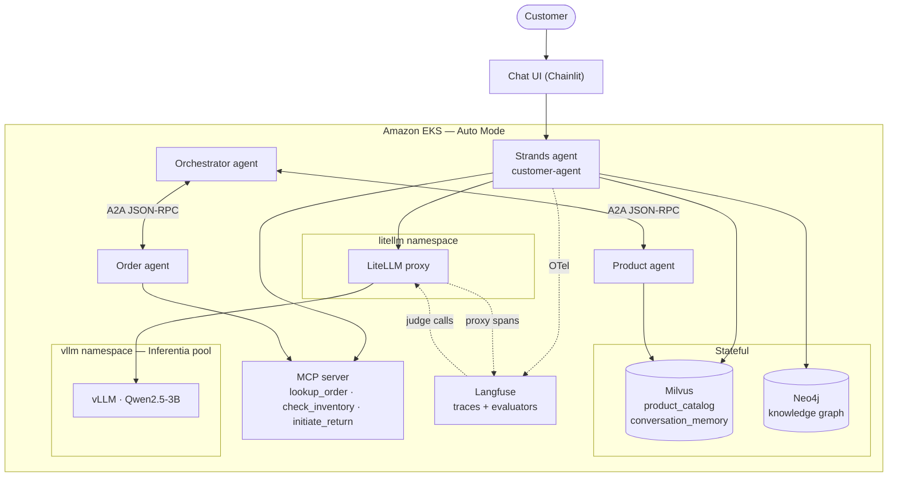
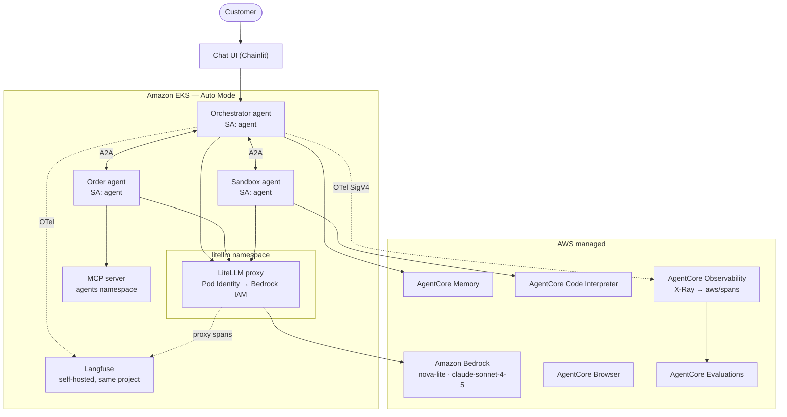

# Architecture

Both topologies. Render at <https://mermaid.live> and export if you want images.

## Self-managed track (§20)



Nine components in the cluster at the end state. Components come online progressively; Neo4j only
appears in the final module.

## Integrated track (§30)



Business tools stay in the cluster; sandboxed execution and memory are managed. The §550 agent
dual-exports every span — Langfuse for the human trace view, AgentCore Observability for the
evaluators.

## The model plane, shared by both

```
Agent pod (either track)
  OpenAIModel(base_url=LITELLM_BASE_URL, model_id=…)
        │
        ▼
┌── LiteLLM proxy (litellm namespace, port 4000) ──────────────┐
│  qwen2-5-3b-neuron → vLLM on Inferentia                      │
│  nova-lite         → bedrock/us.amazon.nova-2-lite-v1:0      │
│  claude-sonnet-4-5 → bedrock/us.anthropic.claude-            │
│                      sonnet-4-5-20250929-v1:0  (judge)       │
└──────────────────────────────────────────────────────────────┘
```

Three facts follow from this shape:

1. Track switching is a `model_id` change in the agent, at single-agent and multi-agent level alike.
2. Bedrock credentials live on the LiteLLM pod via Pod Identity; agent pods are credential-free.
3. Adding a model — including the frontier judge used to score a self-hosted agent — is a route entry,
   not new infrastructure.

## Telemetry, both tracks

```
Strands → OTel spans ──┬── LangfuseSpanProcessor ──▶ Langfuse (AnyCompany Shop)
                       │                              both tracks, same project
                       └── OTLPAwsSpanExporter ─────▶ X-Ray → Transaction Search
                           (SigV4, §30-550 only)      → aws/spans
                                                      → AgentCore Observability
                                                      → AgentCore Evaluations
```

One global `TracerProvider` feeds both. Resource attributes `service.name`, `aws.log.group.names`,
`aws.service.type="gen_ai_agent"`, and `cloud.resource_id` are how the evaluators locate the spans.

## In-cluster service addresses

| Service | Address |
|---|---|
| LiteLLM | `litellm.litellm.svc.cluster.local:4000` |
| vLLM | `qwen2-5-3b-neuron.vllm:8000` |
| Langfuse | `langfuse:3000` |
| Milvus | `milvus.milvus.svc.cluster.local:19530` |
| Neo4j | `neo4j.neo4j.svc.cluster.local:7687` |
| MCP (integrated) | `mcp-server.agents.svc.cluster.local:8080/mcp` |
| X-Ray OTLP | `https://xray.{REGION}.amazonaws.com/v1/traces` |
